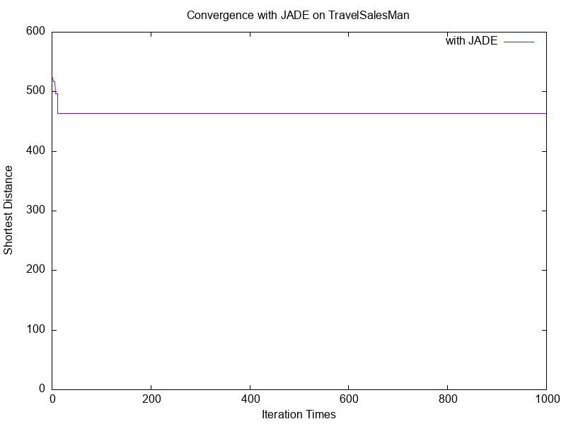

# Implement ACO & JADE to Solve the Traveling Salesman Problem

## ( I ) Introduction

- **Programming language:** C++
- **Metaheuristic algorithm:** Ant Colony Optimization (ACO), adaptive DE (JADE)
- **Benchmark problem:** Traveling Salesman Problem (TSP)
- **Supports configurable parameters:** iteration times

## ( II ) Main Functionality

### `Ant Colony Optimization (ACO)`
- `void RunALG(const int &iter, const double &eva_rate, const int &weight_pher, const int &weight_heu)`\
  *Runs the ACO algorithm for **`iter`** iterations with specified parameters*

- `void Init()`\
  *1. Reads **`city_coordinates`** from .txt file*    
  *2. Initializes heuristic values and pheromone matrix*

- `vector<int> Path_construct(int start_city)`\
  *Constructs a tour starting from **`start_city`** visiting all cities*

- `double Cal_dis(const vector<int> &visited_order)`\
  *Calculates total tour distance of the visited city order*

- `double Cal_edge(const int &from, const int &to)`\
  *Calculates distance between two cities (from → to)*

- `vector<int> SelectTopIdx(const vector<double> &recent_dis_record, const int &top_n)`\
  *Selects and returns indices of top **`n`** shortest tours*

- `void Apply_2_Opt(const int &top_n)`\
  *Applies 2-opt local search to top **`n`** tours and updates global best*

- `void Update_pheromones()`\
  *Updates pheromone levels based on ant tours*

- `vector<pair<int, int>> ReadCityCoord(const string &filename)`\
  *Reads city coordinates from file and returns vector of pairs*

### `adaptive DE (JADE)`
- `void RunALG(const int& iter, const double& mCR, const double& mF, const double& c, const double& p)`   
*Runs the JADE algorithm for **`iter`** iterations with specified parameters*

- `void Init()`       
*1. Reads **`city_coordinates`** from .txt file*   
*2. Compute distance matrix `city_dis` using `Cal_edge`*   
*3. Generate all random-key encoded solutions for this generation = org_keys_record*     
*4. Initialize global and current best path and distance*

- `vector<pair<int, int>> ReadCityCoord(const string& filename)`       
*Reads city coordinates from file and returns vector of pairs*

- `vector<vector<double>> KeyConstruct(const int& pop_size)`       
*Generate all random-key encoded solutions for this generation*

- `double Cal_path(const vector<int>& visited_order)`       
*Calculates total tour distance of the visited city order*

- `double Cal_edge(const int& from, const int& to)`       
*Calculates distance between two cities (from → to)*

- `vector<vector<double>> Mutation(vector<double>& CR, vector<double>& F, const vector<vector<double>>& org_keys_record)`       
*1. Generate CR[] and F[] for this generation using current-to-pbest mutation*     
*2. Apply mutation to `org_keys_record` and return `donor_keys_record` *

- `vector<vector<double>> Crossover(const vector<double>& CR, const vector<vector<double>>& org_keys_record, const vector<vector<double>>& donor_keys_record)`       
*Perform crossover between original and donor individuals to generate new population*

- `vector<vector<int>> GetCityPermutaiton(const vector<vector<double>>& current_keys_record)`       
*Continuous-to-permutation strategy: convert random keys to city visit order，current_pop -> current_path_record*

- `void Evaluation(const vector<vector<int>>& current_path_record, vector<double>& current_dis_record)`       
*Compute distances of all current paths and store in `current_dis_record`*

- `void Apply_2_Opt(const int& top_n)`       
*1. Apply local search on top n individuals*     
*2. update current_shortest_path/dis*

- `vector<int> SelectTopInd(const vector<double>& current_dis_record, const int& top_n)`       
*Select & return top n shortest dis individuals*

- `void ParaAdaptation()`       
*Adapts control parameters `mCR` and `mF`*

## ( III ) Input

### Command-line arguments:

- **Number of Iterations:** `iter = (e.g., 1000)`
- For ACO only:
  - **Pheromone Evaporation Rate:** `eva_rate = (e.g., 0.7)`
  - **Pheromone Importance:** `weight_pher = (e.g., 1)`
  - **Heuristic Importance:** `weight_heu = (e.g., 3)`
- For JADE only:
  - **Crossover rate:** `CR = 0.9 for DE, 0.5 for JADE`
  - **Donor rate / scaling factor:** `F = 0.5 for DE, 0.5 for JADE`
  - **Adaptation rate:** `c = range = 0.05 ~ 0.2`
  - **Top p% used to select x_pbest:** `p = 0.05 ~ 0.2`

## ( IV ) Output

### ACO
- `path_result_TSP_ACO_total1000iter_pop60_evaporate0_pher1_heu3.txt`: Coordinates of the best path
- `dis_result_TSP_ACO_total1000iter_pop60_evaporate0_pher1_heu3.txt`: Best distance per iteration
- `plot_ACO_path.plt`: Gnuplot script for visualizing path
- `plot_ACO_dis.plt`: Gnuplot script for plotting convergence
- `path_result_TSP_ACO_total1000iter_pop60_evaporate0_pher1_heu3.png`: Visualized best path
- `dis_result_TSP_ACO_total1000iter_pop60_evaporate0_pher1_heu3.png`: Convergence plot of best distances

### JADE
- `path_result_TSP_JADE_total1000iter_pop60_c20_p20.txt` : Coordinates of the best path
- `dis_result_TSP_JADE_total1000iter_pop60_c20_p20` : Best distance per iteration
- `plot_ACO_path.plt`: Gnuplot script for visualizing path
- `plot_ACO_dis.plt`: Gnuplot script for plotting convergence
- `path_result_TSP_JADE_total1000iter_pop60_c20_p20.png` : Visualized best path
- `dis_result_TSP_JADE_total1000iter_pop60_c20_p20.png` : Convergence plot of best distances

## ( V ) How to Compile, Run, and Visualize Results

### Compile

#### Visual Studio

1. Open the solution file `TSP.sln`
2. Press `Ctrl + F5` to build

#### VSCode

1. Open CMD or PowerShell
2. Navigate to the working directory
3. Run:

```bash
g++ main.cpp TSP.cpp ACO.cpp -o TSP.exe
```

### Run

1. Place `TSP_HW_point.txt` in the executable directory
2. Open CMD or PowerShell
3. Run:

```bash
.\TSP.exe iter
```
You will be prompted:
```bash
Choose Algorithm ( ACO / JADE )
```
If you select ACO, you will be further prompted:
```bash
Please enter eva_rate = 
Please enter weight_pher = 
Please enter weight_heu = 
```
Example:

```bash
.\TSP.exe 1000
ACO
0.7
1
3
```
If you select ACO, you will be further prompted:
```bash
Please enter initial mCR = 
Please enter initial mF = 
Please enter the value of adaptation rate c = 
Please enter the value of the top % pop chosen for pbest = 
```
Example:

```bash
.\TSP.exe 1000
JADE
0.5
0.5
0.2
0.2
```

### Plot Results

1. Install gnuplot
2. Open CMD or PowerShell
3. Run:

```bash
gnuplot plot_ACO/JADE_path.plt
gnuplot plot_ACO/JADE_dis.plt
```

Result PNGs will be saved in the same directory

## ( VI ) File Structure

```
TSP/
|
├── main.cpp
├── TSP.cpp / TSP.h
├── ACO.cpp / ACO.h
├── JADE.cpp / JADE.h
│
├── results/  ← output files (.txt, .png)
└── README.md ← this file
```

## ( VII ) Experimental Results
> Parameter Setup: iteration_num = 1000 | pop_size = 60 | city_num = 51
### ACO
<p align="center">
  
  
</p>

---
### JADE
<p align="center">
  
  
</p>

---
### JADE with swap-based mutation trategy
<p align="center">
  
  
</p>


## ( VIII ) Observations

- ACO adapts well to combinatorial optimization problems like TSP.
- The `evaporation rate` controls exploration vs exploitation balance.
- 2-opt local search enhances convergence of elite ants.
- `heuristic weight` heavily influences solution diversity.
---
- JADE is inherently designed for continuous optimization and does not naturally fit the permutation-based TSP structure.
- Applying differential mutation on random-key encoded vectors often results in unstable and erratic permutations due to small numerical shifts causing large order changes.
- The algorithm frequently stagnates in local optima when using standard current-to-pbest mutation and binomial crossover.
- Integrating 2-opt post-processing partially mitigates local stagnation, but the global exploration remains weak.
- **Attempted swap-based mutation (in-place shuffling of random-key vector values) leads to even worse performance, indicating that local mutations in random-key space do not translate effectively into quality permutation improvements.**

## ( IX ) Key Features

- Configurable metaheuristic parameters (iterations, evaporation, weights).
- Efficient local search integration via 2-opt.
- City coordinate parsing from file.
- Gnuplot-compatible outputs for result visualization.
---
- Random-key encoding to bridge continuous DE-based JADE with discrete TSP solution space.
- Custom mutation and crossover design adapted from JADE to support permutation decoding.
- Runtime logging of global best updates per iteration.
- Integration of swap mutation experiments to evaluate its effect on discrete permutation quality.

## ( X ) Skills Demonstrated

- Metaheuristic algorithm implementation for combinatorial problems.
- Integration of global search (ACO) with local optimization (2-opt).
- Modular programming and data abstraction in C++.
- Visualization with gnuplot.
- File I/O and structured performance logging.
---
- Adapting a continuous-space optimizer (JADE) to work with discrete permutation problems via ranking-based encoding.
- Designing, testing, and evaluating custom mutation strategies for permutation stability.
- Performance analysis and algorithmic tuning based on convergence behavior and solution structure.
- Identifying mismatch between optimizer assumptions (continuous space) and problem nature (discrete structure), and proposing structural workarounds.

